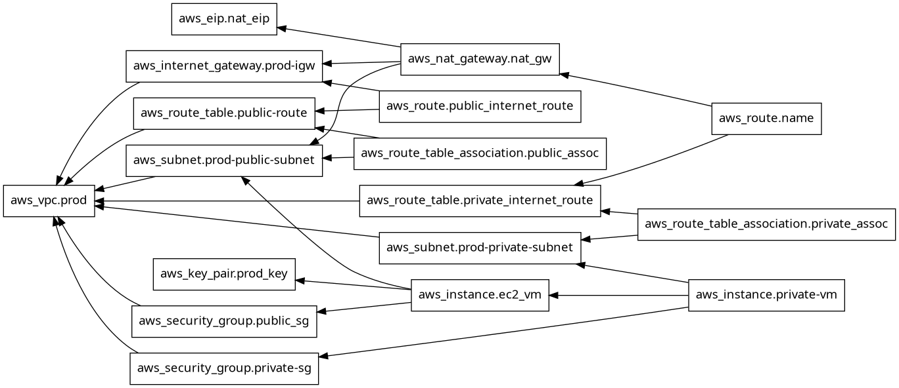

Terrafrom AWS VPC + EC2 infratructure

Prerequisites

    Make sure you have the following installed:
        - Terraform
        - AWS CLI
        - An AWS account
        - IAM user with programmatic access

Overview
This project provisions a production-style AWS infrastructure using Terraform, including:
    Custom VPC
    Public & Private Subnets
    Internet Gateway & NAT Gateway
    Route Tables (Public & Private)
    Bastion Host (Public EC2)
    Private Backend EC2 Instances
    Security Groups
    Key Pair for SSH access

Architecture

    VPC (10.0.0.0/16)
    │
    ├── Public Subnet (10.0.1.0/24)
    │   ├── Internet Gateway
    │   ├── NAT Gateway
    │   └── Bastion EC2 (Public Access)
    │
    └── Private Subnet (10.0.2.0/24)
        └── Backend EC2 Instances (No direct internet access)

Resource Created

    Networking
        VPC
        Public & Private Subnets
        Internet Gateway
        NAT Gateway (with Elastic IP)
        Route Tables & Associations
    
    Compute
        2 Public EC2 instances (Bastion)
        2 Private EC2 instances (Backend)

    Security
        Public Security Group (SSH from anywhere ⚠️)
        Private Security Group (SSH only from public subnet)

Key Features
    Uses variables for reusability
    Uses count for multiple public instances
    Uses for_each for dynamic private instances
    Implements NAT Gateway for private subnet internet access
    Uses depends_on for dependency control
    Conditional logic:
        var.env == "prod" ? 20 : var.default_root_volume

How to use

    Initailize Terraform 
        terrafrom init 

    Validate Terraform --> to check if there are any error 
        terrafrom validate

    Preview the changes 
        terrafrom plan

    Apply infrastructure
        terrafrom apply 

    Destroy Infrastructure
        terrafrom destroy

Output 

    Public Ec2 IP:- public_vm_ip_address

    Private Ec2 IPs:- backend_vm_proivate_ip

Variable Used

    | Variable              | Description | Default     |
    | --------------------- | ----------- | ----------- |
    | default_region        | AWS region  | us-east-1   |
    | default_ami_image     | AMI ID      | (provided)  |
    | default_instance_type | EC2 type    | t2.nano     |
    | default_cidr_block    | VPC CIDR    | 10.0.0.0/16 |

What I learned

    Designing secure VPC architecture
    Public vs Private subnet routing
    NAT Gateway usage
    Terraform dependency management
    Writing reusable and scalable infrastructure code

Terraform dependency Graph 
    So how to get the dependency graph 
        terraform graph | dot -Tpng > graph.png

        

Key Observations
    Infrastructure follows a dependency-driven creation model
    Public resources depend on Internet Gateway
    Private resources depend on NAT Gateway
    Explicit depends_on used for controlled provisioning